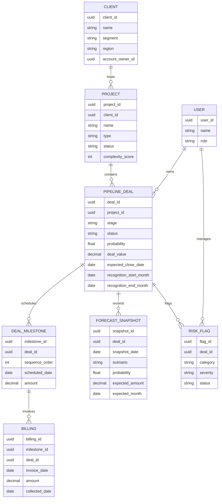
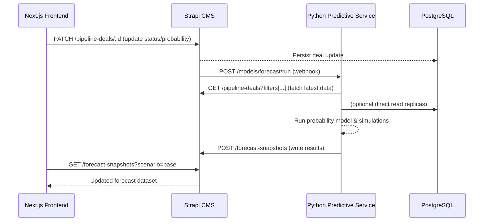
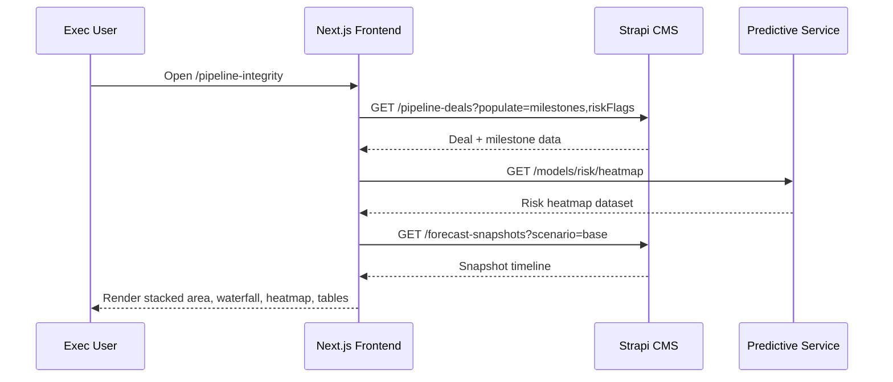

# Visual Scope

## Entity Relationship Overview

## Data Flow Sequence (Forecast Recompute)

## Dashboard Data Retrieval Sequence

## Integration Notes
- Mermaid diagrams illustrate relationships and sequences; adjust attributes as schema evolves.
- Forecast recompute path highlights webhook-triggered model execution.
- Dashboard retrieval flow separates Strapi CRUD data from predictive analytics endpoints.
- **For complete API endpoint specifications, see [`api-specification.md`](./api-specification.md).**

